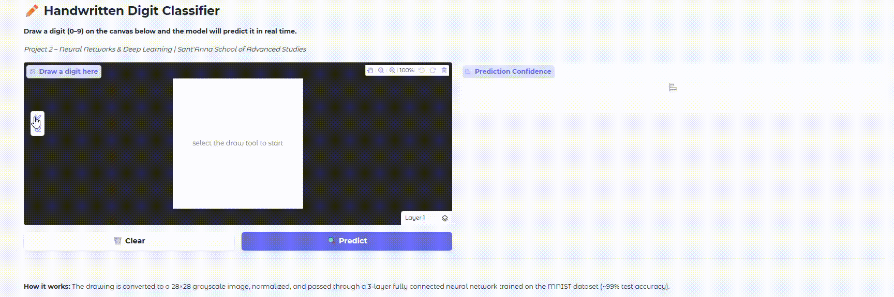
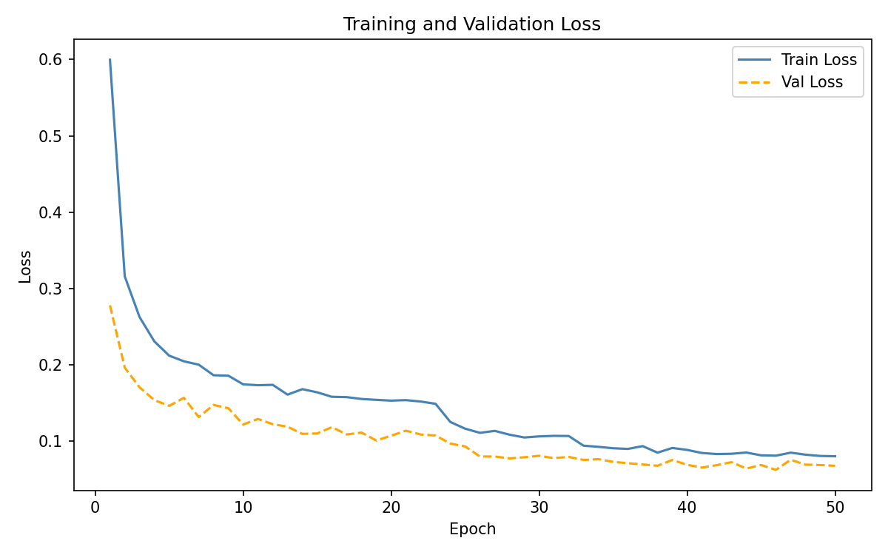
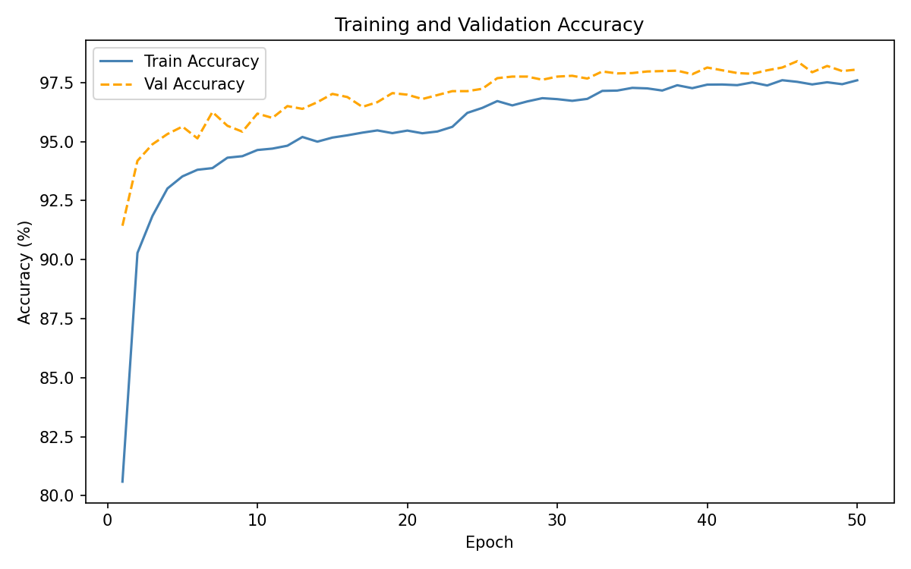
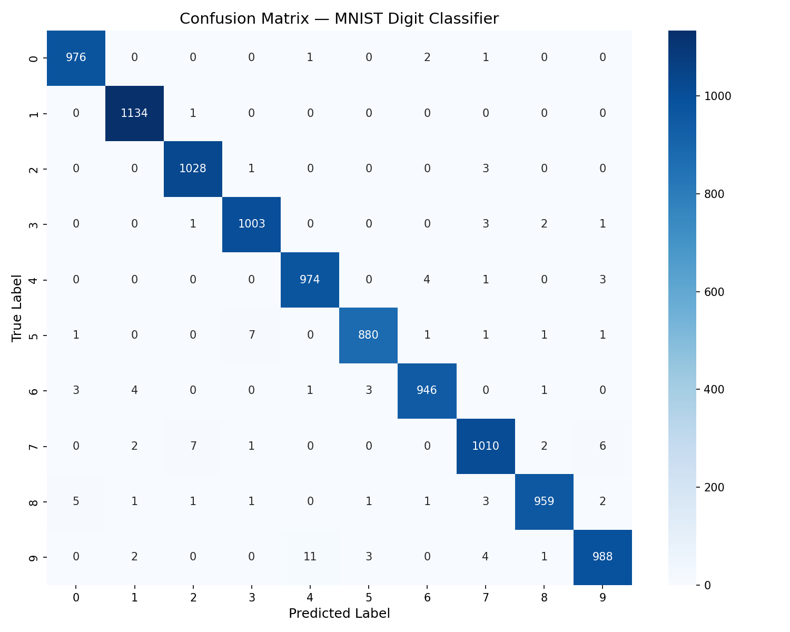

# ✏️ Handwritten Digit Classifier

[](https://www.python.org/)
[](https://pytorch.org/)
[](https://developer.nvidia.com/cuda-toolkit)
[](https://gradio.app/)
[](http://yann.lecun.com/exdb/mnist/)

A real-time handwritten digit classifier built with **PyTorch** and **Gradio**. 
Draw any digit (0–9) on the canvas and the model predicts it instantly with 
confidence scores for all 10 classes. 
> 🎓 **Course Project**: *Neural Networks & Deep Learning Theoretical Foundations*
> 
> University of Pisa & Sant'Anna School of Advanced Studies, Pisa, Italy

> 👨‍🔬 **Author:** Kabir Bakhshaei: Ph.D. Student in Artificial Intelligence

---

## 🎥 Demo

Draw a digit (0–9) on the canvas and the model predicts it in real time!



---

## 🧠 Model Architecture

A 3-layer fully connected neural network trained on the MNIST dataset:

```
Input (784) → FC1 (512) → ReLU → Dropout(0.3)
            → FC2 (256) → ReLU → Dropout(0.3)
            → FC3 (10)  → Softmax
```

| Layer   | Input | Output | Activation |
|---------|-------|--------|------------|
| FC1     | 784   | 512    | ReLU       |
| FC2     | 512   | 256    | ReLU       |
| FC3     | 256   | 10     | Softmax    |

---

## 📁 Project Structure

```
digit-classifier/
├── src/
│   ├── model.py        # Neural network architecture
│   ├── train.py        # Training script
│   ├── evaluate.py     # Evaluation metrics & confusion matrix
│   └── utils.py        # Helper functions (save/load model, preprocessing)
├── app.py              # Gradio web interface
├── requirements.txt    # Python dependencies
├── model.pth           # Trained model weights (generated after training)
└── assets/             # Screenshots and plots
```

---

## 🚀 Getting Started

### 1. Clone the repository
```bash
git clone https://github.com/KabirBakhshaei/digit-classifier.git
cd digit-classifier
```

### 2. Activate the conda environment
```bash
conda activate E:\Software\CondaEnv\pinns_cuda
```

### 3. Train the model
```bash
cd src
python train.py
```
Downloads MNIST automatically, saves best model to `model.pth`, and writes training curves + CSV log to `results/`.

### 4. Evaluate performance
```bash
python evaluate.py
```
Saves exact metrics to `results/evaluation_results.json` and confusion matrix to `results/` and `assets/`.

### 5. Launch the app
```bash
cd ..
python app.py
```
Open your browser at `http://localhost:7860` and start drawing!

---

## 📊 Results

| Metric            | Value       |
|------------------|-------------|
| Test Accuracy     | 98.98%      |
| Parameters        | 535,818     |
| Max Epochs        | 50 (early stopping active) |
| Optimizer         | Adam        |
| Learning Rate     | 0.001       |
| Early Stopping    | patience=7  |

---

## 📈 Training Results

| Loss Curve | Accuracy Curve |
|-----------|----------------|
|  |  |

## 🔢 Confusion Matrix


## ⚙️ Hyperparameters

| Parameter              | Value                        |
|-----------------------|------------------------------|
| Batch Size            | 64                           |
| Learning Rate         | 0.001                        |
| Max Epochs            | 50                           |
| Dropout               | 0.3                          |
| Optimizer             | Adam (β₁=0.9, β₂=0.999)     |
| Loss Function         | CrossEntropyLoss             |
| LR Scheduler          | ReduceLROnPlateau (p=3, ×0.5)|
| Early Stopping        | patience=7, δ=0.0001         |
| Weight Init           | Xavier Uniform               |

---

## 🔧 Environment

| Component      | Version / Details                         |
|---------------|-------------------------------------------|
| Python         | 3.10.19                                   |
| PyTorch        | 2.5.1 (CUDA 12.1, cuDNN 9)               |
| TorchVision    | 0.20.1                                    |
| NumPy          | 2.0.1                                     |
| Matplotlib     | 3.10.8                                    |
| Pillow         | 11.1.0                                    |
| PyYAML         | 6.0.3                                     |
| Gradio         | 6.10.0                                    |
| Seaborn        | 0.13.2                                    |
| Scikit-learn   | 1.7.2                                     |
| Conda env      | `pinns_cuda` @ `E:\Software\CondaEnv\`   |
| GPU            | NVIDIA RTX 3060 Laptop (6 GB VRAM)        |
| CUDA Toolkit   | 12.1                                      |
| NVIDIA Driver  | 566.07                                    |

---

## 📄 License

MIT License — feel free to use and modify.

---

*Built as part of the Neural Networks & Deep Learning course at Sant'Anna School of Advanced Studies, Pisa, Italy.*
